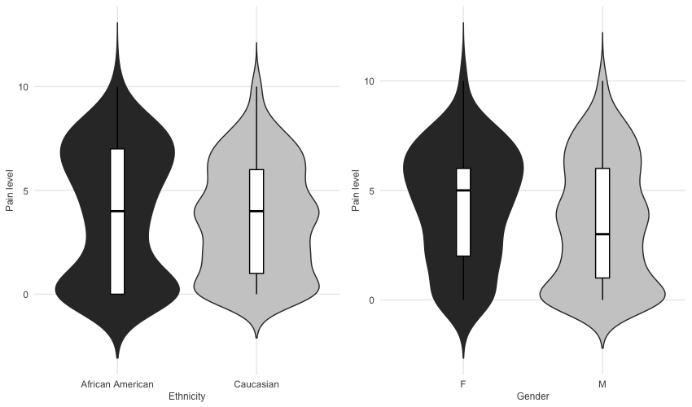
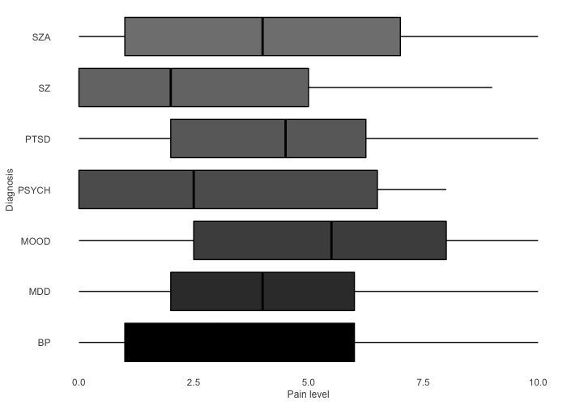
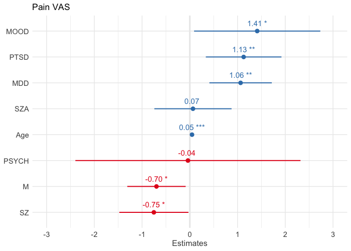

## Statistical analysis: Exploring the connections between pain levels and patients' demographic characteristics
##### Elena Williams


#### Content structure:


1. [Introduction](#introduction) 
2. [Exploratory Data Analysis](#Exploratory-Data-Analysis) 
    + Data Cleaning 
    + Setting the Hypothesis
    + Visualising the Distribution 
    + Checking Skewness and Kurtosis
    + Testing Variables on Homogenity of Variances using Bartlett's Test

3. [Testing Differences Between Means](#Testing-Differences-Between-Means) 
    + Two-sample T-test
    + One-way ANOVA
    + Tukey Honest Significant Differences

4. [Regression Analysis](#Regression-Analysis) 
    + Scatter Plot
    + Building a Model
    + Multicollinearity Check using Variance Inflation Factor
    + Performance Evaluation with Root Mean Squared Error
5. [Conclusion](#Conclusion) 

[References](#References) 

_____________________________________________________________________________________________


# Introduction

In the presented report, I am going to analyse a dataset from a recent study published in Nature (Niculescu & et al, 2019) where scientists endeavored to identify objective blood biomarkers for pain, a subjective sensation with a biological basis. The sample of interest were psychiatric patients, a high risk group for co-morbid pain disorders and increased perception of pain. The data on demographic characterists was published along with the paper and will be examined in the following report. 

In the study there were 794 observations (patients) and 6 characteristics given:

* Participant ID:  ID attached to each of the participant of the study
* Gender:  male or female
* Age:  age of the participants
* Ethnicity:  sample contained patients whose ethnicity was Caucasian, African American, Hispanic, Asian American, Mixed and Asian
* Pain Scale:  reported pain level on a scale from 1 to 10
* Diagnosis:  sample included patients with psychiatric conditions like Bipolar disorder (BP),  Schizoaffective disorder (SZA), Schizophrenia (SZ), Major depressive disorder (MDD), Post-traumatic stress disorder (PTSD), Mood disorder (MOOD) and others


The main objective of this study is to explore the connections between pain levels and demographic data.

I will start from uploading all the necessary libraries and then we will move on to the exploratory data anlysis.
~~~~
library(psych)
library(broom)
library(stringr)
library(ggplot2)
library(caTools)
library(purrr)
library(dplyr)
library(plyr)
library(sjPlot)
library(sjmisc)
source("multiplot.R")
set_theme(base = theme_minimal())
~~~~

# Exploratory Data Analysis

### 2.1. Data Cleaning

Firstly, I remove the variable containing participants' IDs because it will not be used throughout the analysis.
Next, I rename a column with the pain scale into "Pain_VAS". VAS is a visual analogue scale which is a psychometric response scale often presented in questionnaires in the range between 0 and 10. 

Subsequently, I noted that there are some blank cells in the data set. The pain variable has 181 missings. These cells will be converted in NAs, namely missing data points in R. This conversion allows us to exclude the obseravtions with missing data from further analysis. Finally, we can look at the summary statistics which you can find on the table 1. 

```{r, warning=FALSE, message=FALSE}
demographicDB <- read.csv("demographic_data.csv")
demographicDB = demographicDB[,-1] 
colnames(demographicDB) = c("Diagnosis", "Gender", "Age", "Ethnicity", "Pain_VAS") 
demographicDB$Pain_VAS[demographicDB$Pain_VAS==""] <- NA
demographicDB$Diagnosis[demographicDB$Diagnosis==""] <- NA
demographicDB$Pain_VAS = as.character(demographicDB$Pain_VAS)
demographicDB$Pain_VAS = as.numeric(demographicDB$Pain_VAS)
demographicDB$Ethnicity = as.character(demographicDB$Ethnicity)
demographicDB$Ethnicity = ifelse(str_detect(demographicDB$Ethnicity,"caucasian"),"Caucasian",demographicDB$Ethnicity)
demographicDB$Ethnicity = as.factor(demographicDB$Ethnicity)
demographicDB_summary = demographicDB[,-2]
pander::pander(summary(demographicDB_summary), caption = "Summary Statistics")
```


The decoding of the diagnosis abbreviation can be found in the Introduction. We note that the mean age in the sample is quite high, 49 years old, the majority of patients are causasians and african american. Th median pain level is 4.


### 2.2. Setting the Hypothesis

It is not shown in the table above but I noticed that despite there are 158 female and 636 male patients in the sample, only 111 women and 371 men recorded their pain levels. In the further analysis I would like to examine (i) whether the pain sensations vary between males and females and (ii) whether there is a difference in pain sensations between groups of patients with different diagnosis.      

The following hypothesis were set:

<sup>Hypothesis 1. ***Null hypothesis** : There is no difference in pain sensations between men and women. **Alternative hypothesis** : There is a difference in pain sensations between men and women*</sup>

<sup>Hypothesis 2. ***Null hypothesis** : There is no difference in pain sensations between the given diagnosis. **Alternative hypothesis** : There is a difference in pain sensations between the given diagnosis*</sup>


Based on the null hypothesis we assume that there is (HO.1) no difference in pain sensations between men and women and (H0.2) there is no difference in pain sensations between the patients with different diagnosis. Otherwise, the alternative hypothesis is that the true difference in means is not equal to 0.

The pain levels is a continuous random variable and the gender, diagnosis and ethnicity characteristics are discrete random variables.

Before performing hypothesis tests I will look at the distributions of the variables using histogram plot and grouped bar charts.


### 2.3. Visualising the Distribution

From the figure below we note that the majority of patents did not have any pain and very few did have a very strong pain. From that we can say that the pain scores have a slightly right-skewed distribution. Most of the patients had recorded their pain sensations from low to considerable level.


```{r, warning=FALSE}
df.plot <- ggplot(demographicDB, aes(x = Pain_VAS)) +
  geom_histogram(binwidth=1, colour = "white",fill="gray35")+
  theme_bw()+
  theme(panel.border=element_blank(),
        axis.title = element_text(size = 9),
        legend.position = "none",
        panel.grid.minor = element_blank(),
        axis.ticks = element_blank())+ labs(x="Pain level", y="Number of patients") 
df.plot

```


**Figure 1: The distribution of pain scores among the patients**


On the next figure I wanted to compare the distribution of pain levels across patients with different gender and ethnical background. I have chosen to compare only African Americans and Causasians. Both of these groups had a big enough sample size so we could draw some conclusions based on comparison figures (other ethnicities had N<10). From the violin plots below we note that African Americans experience low pain as often as considerable pain. The patients with causasian ethnicity experience middle levels of pain as much often as low and high levels of pain. The mean for both groups is similar, however the standard deviation is bigger for African American patients. From the second plot we note that women experience much higher levels of pain on average than men. 

```{r,  warning=FALSE}
demographicDB_violin = demographicDB %>%
   group_by(Ethnicity) %>%
   filter(n()>10)
dp1 <- ggplot(demographicDB_violin, aes(x=Ethnicity, y=Pain_VAS, fill=Ethnicity)) + 
  geom_violin(trim=FALSE)+
  geom_boxplot(width=0.1, fill="white")+
  labs(x="Ethnicity", y = "Pain level")+ scale_fill_grey()  +
  theme_bw()+
  theme(panel.border=element_blank(),
        axis.title = element_text(size = 9),
        legend.position = "none",
        panel.grid.minor = element_blank(),
        axis.ticks = element_blank()) 

dp2 <- ggplot(demographicDB, aes(x=Gender, y=Pain_VAS, fill=Gender)) + 
  geom_violin(trim=FALSE)+
  geom_boxplot(width=0.1, fill="white")+
  labs(x="Gender", y = "Pain level")+ scale_fill_grey()  +
  theme_bw()+
  theme(panel.border=element_blank(),
        axis.title = element_text(size = 9),
        legend.position = "none",
        panel.grid.minor = element_blank(),
        axis.ticks = element_blank()) 
multiplot(dp1,dp2, cols=2)
```



**Figure 2: The distribution of pain levels across patients with different gender and ethnical background**

Now I would like to compare pain levels across parients with different diagnosis. From the figure below we note that patients with Schizoaffective, Post-traumatic stress and Mood disorders have reported much higher pain levels on average.
Meanwhile patients with Schizophrenia and Psychiatric disorder have reported considerably lower pain senasations.

```{r, warning=FALSE}
dp <- ggplot(data = subset(demographicDB, !is.na(Diagnosis)), aes(x=Diagnosis, y=Pain_VAS, fill=Diagnosis,na.rm = TRUE)) + 
  geom_boxplot()+
  labs(x="Diagnosis", y = "Pain level")+ coord_flip()+ scale_fill_grey(start = 0, end = 0.5)  +
  theme_bw()+
  theme(panel.border=element_blank(),
        axis.title = element_text(size = 9),
        legend.position = "none",
        panel.grid.minor = element_blank(),
        panel.grid.major = element_blank(),
        axis.ticks = element_blank()) 

```


**Figure 3: The distribution of pain scores among the patients with different diagnosis**


### 2.4. Comparing skewness and kurtosis of the factor variables 


Before performing any tests it is important to check data on assumptions about the normality of distribution. Further I will examine skewness and kurtosis of the factor variables such as Gender and Diagnosis and then apply Bartlett's test.

On the table 2 below we note the coefficients of skewness and kurtosis of pain levels for all the given diagnosis. These measures represent the asymmetry and the *"tailedness"* of pain's distribution for each diagnosis. 
Overall the skewness and kurtosis coefficients look all right for most of the diagnosis categories. We do not observe high kurtosis which would indicate that we have rare patients in our sample with extreme pain levels.

```{r comment='',  message=FALSE, results='asis'}

table_1 = describeBy(demographicDB$Pain_VAS,demographicDB$Diagnosis)
table_1 <- ldply (table_1, data.frame)
table_1 = table_1[,-(14)]
table_1 = table_1[,-(7:11)]
table_1 = table_1[,-(2)]
row.names(table_1) = table_1[,1]
table_1 = table_1[,-(1)]

colnames(table_1) = c("N", "Mean", "SD", "Median", "Skew", "Kurtosis")

table_1$Mean = round(table_1$Mean, 2)
table_1$SD = round(table_1$Median, 2)
table_1$Skew = round(table_1$Skew, 2)
table_1$Kurtosis = round(table_1$Kurtosis, 2)

knitr::kable(table_1, caption = "Skewness and Kurtosis coefficients", floating.environment="sidewaystable")
```


Then I compared the coefficients of skewness and kurtosis of pain levels between the genders. 
Again the skewness and kurtosis coefficients look good. We note again that men on average has lamost 1 level lower pain sensations than women.

```{r comment='', message=FALSE, results='asis'}

table_2 = describeBy(demographicDB$Pain_VAS,demographicDB$Gender)
table_2 <- ldply (table_2, data.frame)
table_2 = table_2[,-(14)]
table_2 = table_2[,-(7:11)]
table_2 = table_2[,-(2)]
row.names(table_2) = table_2[,1]
table_2 = table_2[,-(1)]

colnames(table_2) = c("N", "Mean", "SD", "Median", "Skew", "Kurtosis")

table_2$Mean = round(table_2$Mean, 2)
table_2$SD = round(table_2$Median, 2)
table_2$Skew = round(table_2$Skew, 2)
table_2$Kurtosis = round(table_2$Kurtosis, 2)

knitr::kable(table_2, caption = "Skewness and Kurtosis coefficients", floating.environment="sidewaystable")
```


### 2.5. Testing variables on homogenity of variances using Bartlett's test

Finally, I will check the Gender and Diagnosis variables on homogeneity of variances using Bartlett's test. Both variables have not shown a significant P-value at 0.05 level. For these variables the variance is homogeneous and correction does not needed.

```{r, message=FALSE}
bartlett.test(demographicDB$Pain_VAS,demographicDB$Gender)
bartlett.test(demographicDB$Pain_VAS,demographicDB$Diagnosis) 
table_3 = data.frame("Varibale" = c("Gender", "Diagnosis"),"K-squared" = c(1.2859, 8.1294), "p-value" = c(0.2568, 0.2288))
pander::pander(table_3, caption = "Results of Bartlett's tests for homogeneity of variances")

```


# Testing Differences Between Means

### 3.1. Two-sample T-test

I have chosen a two-sample T-test in which the test statistic follows a Student's t-distribution under the null hypothesis [5]. 

I have used this test to indentify whether the mean difference between two sexes is significant. Taking into consideration the results of Bartlett's test Welch Two-Sample T-test was applied for proteins IL.6 and CSF.1 .

The results have shown that biomarkers VEGF.A, TGF.beta.1, CXCL1 and CSF.1 have a difference in means between men and women at 0.05 significance level. We reject the null hypothesis that the difference in means is equal to 0 and accept an alterantive hypothesis.

Tests with other proteins have shown no significant difference in means.

To conclude, women and men with medical conditions causing pain have a mean difference in VEGF.A, TGF.beta.1, CXCL1 and CSF.1 proteins levels at inclusion. No significant differences were found in IL.8, OPG, IL.6, CXCL9, IL.18 protein levels.

```{r, message=FALSE, warning=F}
t1=t.test(Pain_VAS~Gender,demographicDB, var.equal=T) # p-value = 0.001774
table_4 <- map_df(list(t1), tidy)
table_4 = table_4[,-(6:9)]
colnames(table_4) = c("Mean-1", "Mean-2", "T-statistic", "P-value",   "DF")
pander::pander(table_4, caption = "Results of Two Sample t-test")
```


### 3.2. One-way ANOVA

The one-way analysis of variance (ANOVA), also known as one-factor ANOVA, is an extension of independent two-samples t-test for comparing means in a situation where there are more than two groups. In one-way ANOVA, the data is organized into several groups base on one single grouping variable (also called factor variable). This tutorial describes the basic principle of the one-way ANOVA test and provides practical anova test examples in R software.


ANOVA test hypotheses:

Null hypothesis: the means of the different groups are the same
Alternative hypothesis: At least one sample mean is not equal to the others.
The observations are obtained independently and randomly from the population defined by the factor levels
The data of each factor level are normally distributed.
These normal populations have a common variance. (Levene’s test can be used to check this.)

```{r, message=FALSE, warning=F}
# Compute the analysis of variance
res.aov <- aov(Pain_VAS ~ Diagnosis, data = demographicDB) # p value 6.18e-05
# Summary of the analysis
pander::pander(summary(res.aov), caption = "One-way ANOVA")
```


### 3.3. Tukey Honest Significant Differences

```{r, message=FALSE, warning=F}
with(par(mai=c(1,2.5,1,1)),{plot(TukeyHSD(res.aov), las=1,cex.axis=0.4)})
```


**Figure 5: Mean difference between the groups**


# Regression Analysis 

### 4.1. Scatter plot

```{r, warning=FALSE}
ggplot(demographicDB, aes(x=Age, y=Pain_VAS)) +
  geom_point( color="gray33", alpha=0.85) +
  theme_bw()+
  theme(panel.border=element_blank(),
        axis.title = element_text(size = 9),
        panel.grid.minor = element_blank(),
        axis.ticks = element_blank()) +
    ylab('Pain level') +
    xlab('Age')
```


**Figure 5: Mean difference between the groups**

### 4.2. Modelling

I have constructed a regression model to make predictions on how well patients with medical conditions will recover. 

The dependent variable is a pain level measured one year after onset and independent variables are biomarker levels at inclusion. Covariates such as age, sex and smoke status were also included in the model.

The results have shown that proteins OPG, TGF.beta.1 and IL.6 are strongly related to pain at 0.05 significance level. Both estimates have negative sign meaning that the higher the pain the lower the protein level or vice versa.


```{r,warning=FALSE}
set.seed(101) 
sample = sample.split(demographicDB, SplitRatio = .8)
train = subset(demographicDB, sample == TRUE)
test  = subset(demographicDB, sample == FALSE)
model1 = lm(Pain_VAS~Age+Gender+Diagnosis, train)
plot_model(model1,sort.est = TRUE,show.values = TRUE, value.offset = .3)
```


**Figure 7: The distribution of pain scores among the patients**

### 4.3. Multicollinearity

None of the variables in the model suffers from multicollinearity. Overall the model fits the data quite well.

Table 6: VIF

```{r, message=FALSE}
pander::pander(car::vif(model1),caption = "")
```


### 4.4. Performance evaluation

Usung the previous model I have predicted the pain levels for the remaining 20 % of the patients. In the table below we note that some of the predicted values differ substantially from the actual one.

To evaluate how well the model predicts the pain level I have used an error metric called Root Mean Squared Error. I first have squared the difference between the predicted and the actual values. Then I have calculated the mean and took the square root of it. The average deviation of the estimates from the actual values is 3.3. 

Table 7: First five Actual vs Predicted values and their difference

```{r, message=FALSE}
pred <- predict(model1,  newdata = test)
table4 = as.data.frame(cbind(test$Pain_VAS, pred))
colnames(table4) = c("Actual", "Predicted")
table4$Difference = (table4$Actual-table4$Predicted)
table4$Predicted = round(table4$Predicted,1)
table4$Difference = round(table4$Difference,1)
pander::pander(head(table4,5),caption = "")
```


Root Mean Squared Error is 2.8
```{r, message=FALSE}
table4 = subset(table4, !is.na(Difference))
sqrt(mean(table4$Difference^2))
```

# Conclusion

To conclude, I think that the model is not very useful for predicting the pain level of the patients a year later.
On a scale from 0 to 10 the prediction  which diverges on average from the actual values by 3 points may carry a big risk, especially in a setting of clinical decision-making which can result in significant consequences for the patients' health. 


## References

Niculescu, A.B., Le-Niculescu, H., Levey, D.F., Roseberry, K., Soe, K.C., Rogers, J., Khan, F., Jones, T., Judd, S., McCormick, M.A. and Wessel, A.R., 2019. Towards precision medicine for pain: diagnostic biomarkers and repurposed drugs. Molecular psychiatry, 24(4), p.501.


